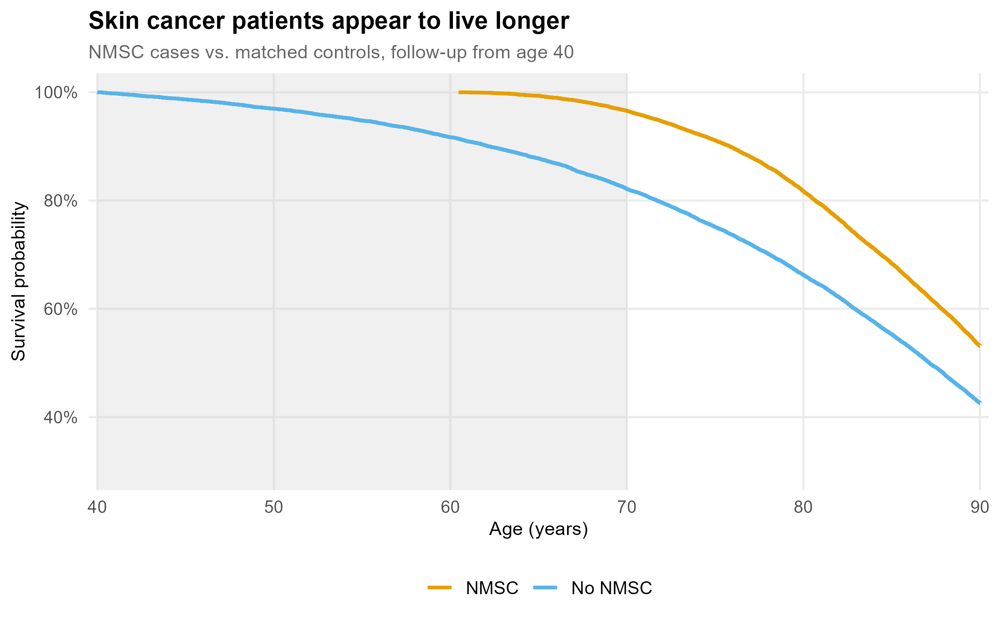
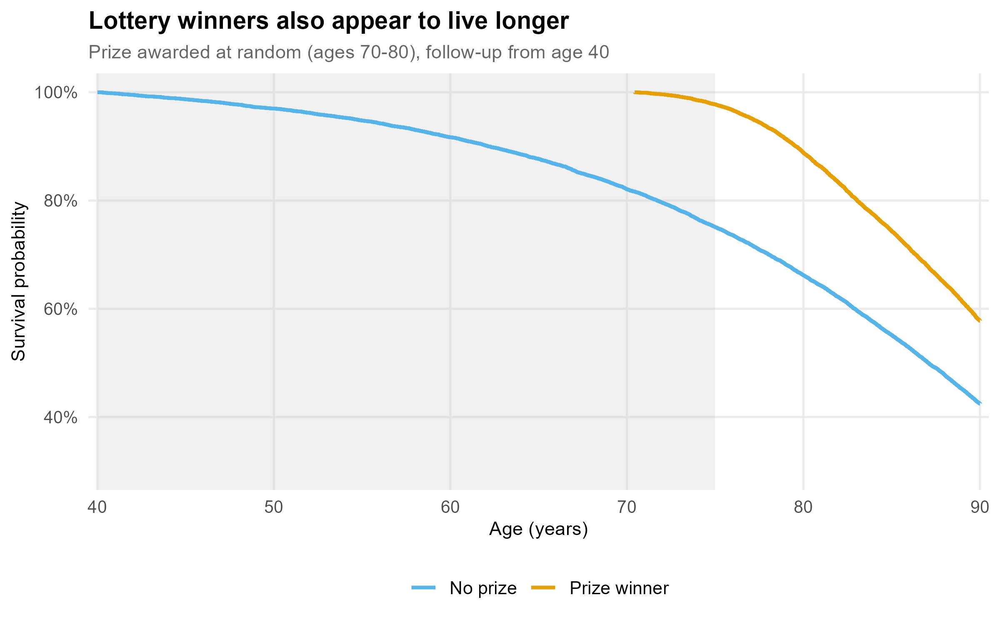
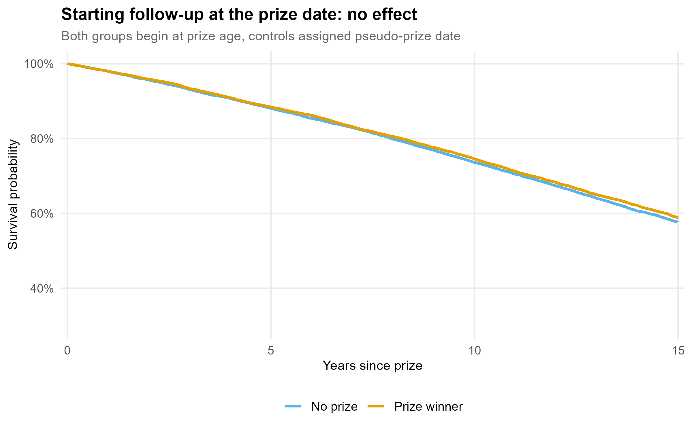

# The Sun, Skin Cancer, and a Statistical Mirage

**Author:** Ólafur B Davíðsson, PhD | **Date:** 2026-03-26 | **Frameshift Insights**

---

In 2013, Brøndum-Jacobsen and colleagues published a study in the *International Journal of Epidemiology* testing whether sun exposure (proxied by skin cancer diagnosis) was associated with better downstream health outcomes. The logic is biologically plausible: more sun means more vitamin D, and vitamin D has known effects on bone metabolism and cardiovascular function.

The dataset is, by any standard, impressive. The investigators used linked Danish national registries covering the **entire Danish population above age 40 from 1980 to 2006**, comprising 4.4 million individuals. This is about as close to complete population follow-up as epidemiology gets. No sampling error, near-zero loss to follow-up, diagnoses from validated national registries.

The results were striking. Compared to the general population:

- Patients with **non-melanoma skin cancer (NMSC)** had an adjusted **HR = 0.52 for all-cause mortality**; their risk of dying appeared to be cut in half.
- They also had lower rates of myocardial infarction and, in those under 90, lower rates of hip fracture.
- Melanoma patients showed a similar but smaller pattern: HR = 0.89 for all-cause mortality.

The biological story writes itself. Sun exposure leads to vitamin D synthesis, which drives calcium metabolism, which produces stronger bones and fewer hip fractures. Or: sun exposure releases nitric oxide, which causes vasodilation, which lowers cardiovascular mortality. Both mechanisms are real phenomena. The effect sizes are large, the confidence intervals are razor-thin from the enormous sample, and the consistency across outcomes is compelling.

The authors themselves were careful to note: *"Causal conclusions cannot be made from our data."* But results like these have a way of persisting in the literature without their caveats.

The simulation below reproduces the study design under the assumption that skin cancer has **zero causal effect on mortality**. Mortality is drawn from a Gompertz model calibrated to Danish population life tables. The grey band marks the immortal time window.



*Simulation of the Brøndum-Jacobsen study design. With no true protective effect, NMSC patients show HR = 0.68 (95% CI 0.66–0.70) for all-cause mortality, closely mirroring the paper's reported HR = 0.52. The grey region marks the immortal time window: the period from age 40 to the average diagnosis age, during which cases had to survive in order to be classified as cases at all.*

---

## The Problem

NMSC (basal cell carcinoma and squamous cell carcinoma) accumulates over a lifetime of sun exposure and is **typically diagnosed between ages 60 and 80**, well after the study's age-40 entry point. This creates a structural problem.

To appear in the "NMSC group," a patient had to survive to their diagnosis. A person diagnosed at age 72 was, by definition, alive from age 40 to age 72. That 32-year window is **immortal time**: they could not have died during it and still ended up in the skin cancer group. Yet this entire survival window enters the analysis as person-time, compared against a general population that includes everyone who died at 45, 55, or 65 before any such diagnosis was ever possible.

This is not confounding. It is not selection bias in the traditional sense. It is a direct consequence of how the comparison groups are constructed. The exposed group accrues a guaranteed survival advantage that has nothing to do with sun exposure, vitamin D, or any biological mechanism whatsoever.

To make this clear, consider the following thought experiment: instead of a skin cancer diagnosis, we award a **lottery prize** to a randomly selected subset of the cohort. The prize is awarded at a random age between 70 and 80, purely by chance, with no connection to health, behaviour, or biology.

We then set up the same study: follow everyone from age 40, compare prize winners to non-winners for all-cause mortality.



*A randomly awarded lottery prize, with no conceivable biological mechanism, produces HR = 0.57 (95% CI 0.55–0.59) for all-cause mortality. The effect is actually larger than in the NMSC simulation, because the prize window (ages 70–80) sits later in life than the NMSC diagnostic window (ages 60–80), creating a longer immortal time window on average.*

The lottery makes explicit what the skin cancer design obscures: **the "protective effect" is a property of the study design, not of the exposure.** Any event awarded after study entry that requires surviving to receive it will produce exactly this pattern. The magnitude of the effect scales directly with how late the event occurs, which is precisely why the NMSC effect (HR = 0.52, diagnosed in the 60s–80s) dwarfs the melanoma effect (HR = 0.89, diagnosed earlier and also directly lethal).

The biological narrative is constructed after the fact to fit a result that would have emerged regardless of what the exposure was.

---

## The Correction

The fix is straightforward. Instead of starting follow-up at age 40 for everyone, we start follow-up at the **date of the prize award**. Controls are assigned a corresponding pseudo-prize date at the same age as their matched case. Both groups now begin observation at the same point in time. The immortal window is removed.



*Once follow-up begins at the prize date and controls are assigned a matched pseudo-prize age, the curves collapse onto each other. HR = 0.97 (95% CI 0.93–1.01), p = 0.14. There is no effect, because there never was one.*

The equivalent correction in the original study would be to use the skin cancer diagnosis date as the index date for each patient, counting only person-time after the diagnosis, or to implement the exposure as a time-varying covariate in a Cox model, where individuals contribute unexposed time until diagnosis and exposed time thereafter.

---

## Take-Home

Immortal time bias is easy to introduce and easy to miss. The conditions that produce it (a large national registry, a long follow-up, a diagnosis that requires surviving to be diagnosed) are exactly the conditions of many high-profile observational studies. The bias is also easy to rationalise post-hoc: when the result fits a plausible mechanism, the temptation to work backwards from the finding to the story is strong.

The lottery prize exercise removes the biology entirely and shows that the result survives. That is the diagnostic. If you can replace the exposure with something biologically inert and get the same answer, the exposure is not doing the work; the design is.

In matched or registry-based cohort studies, always ask: when does follow-up start, and is that the same for cases and controls? If cases are defined by an event that occurs after study entry, and controls are drawn from a general population without that constraint, you are likely looking at immortal time.

---

<details>
<summary>Simulation code</summary>

```r
library(survival)
set.seed(42)

# Gompertz mortality: h(t) = a·exp(b·t), t = years since age 40
# Calibrated to Danish adult life tables (~age 87 median survival)
sim_death_age <- function(n, a = 0.00195, b = 0.0685) {
  u <- runif(n)
  40 + (1/b) * log(1 - (b/a) * log(1 - u))
}

n             <- 20000
death_case    <- sim_death_age(n)
death_control <- sim_death_age(n)
obs_case      <- pmin(death_case,    90)
obs_control   <- pmin(death_control, 90)

# Prize awarded at random (ages 70-80); no biological mechanism
prize_age <- runif(n, 70, 80)
won       <- prize_age <= obs_case

# Biased: follow-up from age 40
biased <- data.frame(
  time  = c(obs_case[won] - 40,    obs_control[won] - 40),
  event = c(death_case[won] <= 90, death_control[won] <= 90),
  prize = rep(c(1, 0), each = sum(won))
)
coxph(Surv(time, event) ~ prize, data = biased) |> coef() |> exp()
# prize: ~0.57

# Correct: follow-up from prize date, controls assigned matched pseudo-prize
alive   <- death_control[won] > prize_age[won]
correct <- data.frame(
  time  = c(obs_case[won][alive]    - prize_age[won][alive],
            obs_control[won][alive] - prize_age[won][alive]),
  event = c(death_case[won][alive] <= 90, death_control[won][alive] <= 90),
  prize = rep(c(1, 0), each = sum(alive))
)
coxph(Surv(time, event) ~ prize, data = correct) |> coef() |> exp()
# prize: ~0.97
```

Full script including figures: [`analysis.R`](analysis.R)

</details>

---

*At [Frameshift](https://www.frameshift.dk), we work at the intersection of clinical trial methodology, epidemiology, and biostatistics. Problems like this (where a technically defensible analysis produces a deeply misleading result) are exactly the kind of thing we think about. If your study design involves registry data, post-baseline exposures, or time-to-event outcomes, [get in touch](https://www.frameshift.dk).*

---

### Reference

Brøndum-Jacobsen P, Nordestgaard BG, Nielsen SF, Benn M. *Skin cancer as a marker of sun exposure associates with myocardial infarction, hip fracture and death from any cause.* International Journal of Epidemiology. 2013;42(5):1486–1496. https://doi.org/10.1093/ije/dyt168

---

*This post is part of [Frameshift Insights](../README.md), a series of short explorations of epidemiology, biostatistics, and data science by the team at [Frameshift](https://www.frameshift.dk).*
